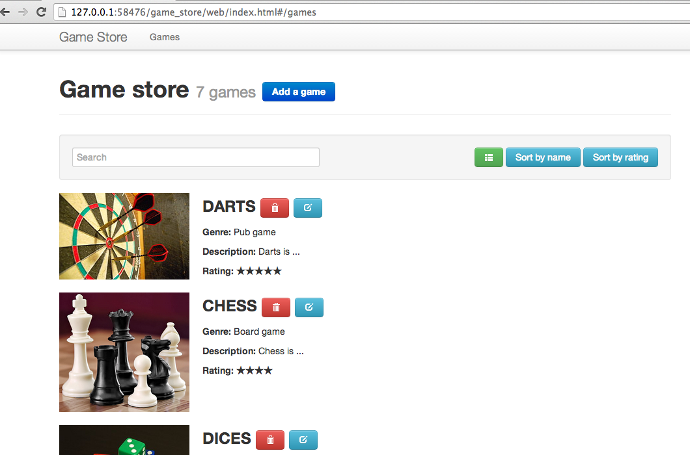

## 8. Single-page application
> **Goal**: _As a user, I want to navigate through pages without reloading the application._

_**Keywords**: router, url pattern_

1. Add `route` dependency in `pubspec.yaml`

    ```YAML
    dependencies:
        route: any
    ```
2. Create a new custom element `x-route` ([Hints](#hints))
  - Create `route.html` and `route.dart` files. Copy this class as it is:  

    ```Dart
    import 'package:polymer/polymer.dart';
    import 'package:route/client.dart';
    
    @CustomTag('x-route')
    class XRoute extends PolymerElement {
      // Whether styles from the document apply to the contents of the component
      bool get applyAuthorStyles => true;
      XRoute.created() : super.created() {
        var router = new Router()
          ..addHandler(gamesUrl, _routeHandler(gamesUrl))
          ..addHandler(gameUrl, _routeHandler(gameUrl))
          ..addHandler(newGameUrl, _routeHandler(newGameUrl))
          ..listen();
    
        route = new Route(gamesUrl);
      }
      
      final gamesUrl = new UrlPattern(r'/(.*)#/games');
      final gameUrl = new UrlPattern(r'/(.*)#/games/(\d+)');
      final newGameUrl = new UrlPattern(r'/(.*)#/games/new');
    
      @observable Route route;
    
      Handler _routeHandler(UrlPattern url) => (String path) {
        print("Route changed: $url - $path");
        route = new Route(url, url.parse(path));
      };
      
      int asInt(String value) => int.parse(value);
    }
    
    class Route {
      final UrlPattern url;
      final List params;
      Route(this.url, [this.params = const []]);
      operator [](int index) => index < params.length ? params[index] : null;
    }
    ```
3. Explore this class
  - When one of registered `UrlPattern` is handled on url change, the `route` attribute is updated. There is already three registered patterns:
    - `#/games`: to show the games list
    - `#/game/1`: to edit the game with id=1
    - `#/games/new`: to create a new game
  - The `Route` class contains the handled `UrlPattern` and the parsed parameters.
  - In databindings, parameters can be retrieved with this syntax: `route[1]` where `1` is the group index in regex
4. In `route.html`, create two contidionnal templates to switch between `x-games` element and `x-game-edit`.
  - Check if the current `route.url` is the expected `UrlPattern`  
  - Don't forget to set the `gameId` attribute from the parsed parameters
5. In `index.html`, use `x-route` instead of `x-game-edit` and `x-games`.
6. Now you can bookmark your games list!  
  

<a name="hints"></a>
> **Hints:**
>
> - Read sample of [Client routing](http://pub.dartlang.org/packages/route)


## [End >](end.md)
